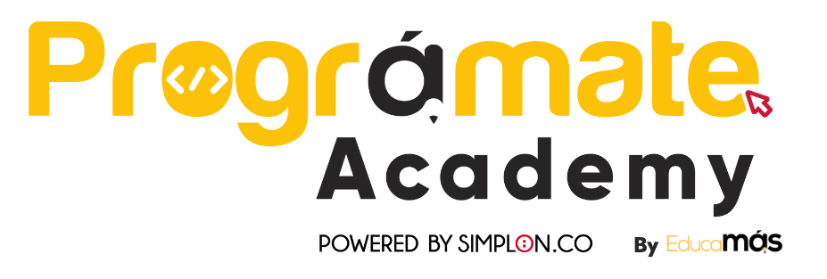

<h1 align="center"> Proyecto CRUD para una lista de tareas </h1>

<h4 style="color: #661BBB";> Autor: Marianny Márquez </h4>
Prográmate Academy 

<h2> Descripción </h2>
Este proyecto contiene operaciones CRUD (Create, Read, Update and Delete) para una lista de tareas para la libería comunitaria.

<h2> Funcionalidades </h2>
<ul>
<li>Obtener todas las tareas, estatus y responsables por las tareas.</li>
<li>Obtener las tareas, estatus y responsables por las tareas por su ID.</li>
<li>Crear y/o agregar una tarea o nuevo responsable.</li>
<li>Actualizar información una tarea, estatus o persona responsable según se requiera.</li>
<li>Eliminar tareas, estatus y responsables de las tareas por su ID.</li>
</ul>

<h2> Tecnologías utilizadas </h2>
<ul>
<li>JavaScript</li>
<li>Node.js</li>
<li>Express</li>
<li>MongoDB</li>
<li>Mongoose</li>
<li>Nodemon</li>
<li>Body Parser</li>
<li>Ejs</li>
<li>Dotenv</li>
<li>HTML</li>
<li>CSS</li>
</ul>

<h2> Uso </h2>
<ol>
  <li>Inicia la aplicación:
    npm start nodemon ó 
    node indes.js</li>

  <li>Desde postman puedes probar los siguentes endpoints los cuales se solicitan y muestan en formato json</li>
    

      <ul> <h4>Tasks</h4>
        <li> http://localhost:3000/api/todo/ </li>
        <li> http://localhost:3000/api/todo/'id'</li>
        <li> http://localhost:3000/api/todo/delete/'id'</li>
        <li> http://localhost:3000/api/todo/create con la siguiente estructura en json </li>
        
          
        {
          "task" : "Asignarle género a los libros",
          "task_responsable" : "Pepito Perez",
          "deadline" : "09-30-2023",
          "status" : "64a600bda2472a22f78cf5b4",
          "update" : "Falta enumerar todos los libros"
          }

         
  <li> http://localhost:3000/api/todo/update/'id'</li>

          
        {
          "task" : "Limpiar libros",
          "task_responsable" : "Pepito Perez",
          "deadline" : "07-30-2023",
          "status" : "64a600bda2472a22f78cf5b4",
          "update" : "Comprar plumón"
          }
        
        
  </ul>
  

    
  

    <ul> <h4>Status</h4> (importante mencionar que sólo hay tres estatus disponibles)
      <li> http://localhost:3000/api/status/</li>
      <li>http://localhost:3000/api/status/'id'</li>
      <li>http://localhost:3000/api/status/update/'id'</li>
        {
        "status" : "pending"
        }
    </ul>
  

  

    <ul> <h4>Task Responsable</h4>
      <li> http://localhost:3000/api/responsable/create</li>
        {
        "task_responsable" : "Mariano Gomez"
        }
      <li>http://localhost:3000/api/responsable/</li>
      <li>http://localhost:3000/api/responsable/'id'</li>
      <li>http://localhost:3000/api/responsable/delete/'id'</li>
      <li>http://localhost:3000/api/responsable/update/'id'</li>
        {
        "task_responsable" : "Gonzzalo Gomez"
        }
    </ul>
  

  <li>Puedes acceder a la aplicación en su parte front end en http://localhost:3000/</li>
</ol>
